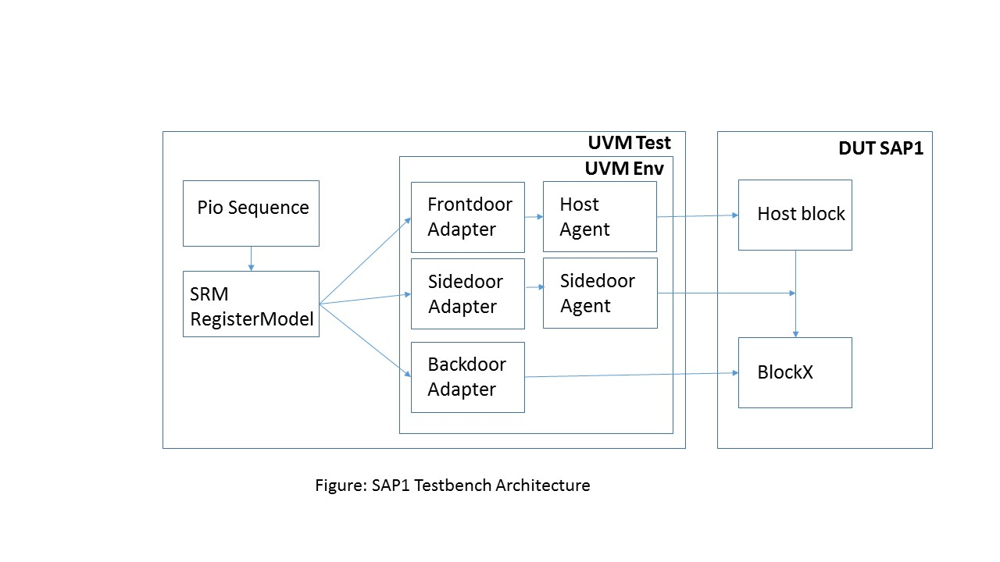

This directory contains "simple as possible" design that is verified using a uvm testbench.
In this example, the register model is modelled using simple_reg_model instead of "uvm_reg" package.

## Design
The design is a chip called 'sap1'. The address map of the chip is shown below.

The chip has 2 blocks 'host' and 'blockX'. The block blk_x contains a 32 bit read/write
register 'r1' and a table of 1024 entries called 't1'.

Our goal is to verify that the read/write access to all these registers and tables are working.

## Register Model
The register model is modelled using the "simpler_reg_model" register package.

## Testbench
The testbench is an uvm compliant testbench as shown below. 

Accesses to the registers can be done
through the host block. For optimizing simulation speed, it is also possible to access the memory
through 'sidedoor' or through 'backdoor'. Sidedoor access bypasses the host block and directly drives the 
signals on the block address decoder. Backdoor access uses hierarichal access to write/read the values in zero time.
