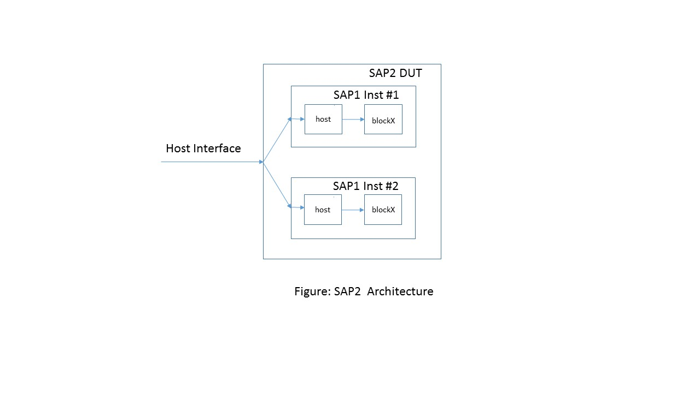
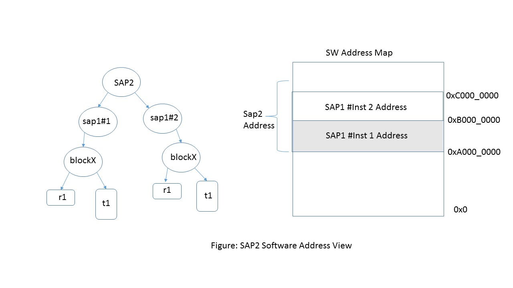

This directory contains "simple as possible" design that is verified using a uvm testbench.
In this example, the register model is modelled using simple_reg_model instead of "uvm_reg" package.  

The demo consists of 3 designs. 
1. Block Level Testbench (BlockA):
Validate a block level design 'BlockA' in a testbench. The blockA has a single register and table, and uses an internal PIO bus to access configuration. 

2. Chip Level Testbench (SAP1)  
Here the DUT is a chip 'SAP1' that instantiates the host block and BlockA. The chip level testbench uses the host bus to access the configuration in BlockA. To speed up simulation time, the sequence
can also use either the internal 'PIO' bus to drive the configuration to the block or background access to directly initialize the configuration. This selection is done dynamically on a per register basis. The key thing is that the block level sequence does not need to change for these new options.


3. System Level Testbench (SAP2) 
This DUT consists of 2 instances of SAP1 block, sharing a single host block. This could be a multichip module or a system level environment. By constructing a suitable env, the same block level sequence can be used to initialize both the instances of SAP1, using either host or the pio bus or backdoor.

## FIXME
1. Merge search adapter into the base_handle class.  
2. How to implement policy. If backdoor is available then use it else fallback to frontdoor. The
frontdoor may be avaialalbe only on the root node.  
3. Provide default handles for these policies. like frontdoor, backdoor.  
4. Locking is not implemented. Not clear on the race conditions 

## Env Setup
The env assumes that you have 'vcs' and 'uvm' already working in your setup.  

1. Download the srm package from *FIXME*  

2. To run the testbench the following envrionment variable must be set.
*SRM_HOME* : Pointer to the install directory for srm package.
*SAP_HOME* : Pointer to this directory.

The Makefile uses these 2 environment variable to find all the source files.

3. A sample file 'my_setup.csh' in this directory sets up my environment.

## Design SAP1
The design is a chip called 'sap1' in dir *sap1/dut*. The address map of the chip is shown below.


The chip has 2 blocks 'host' and 'blockX'. The block blk_x contains a 32 bit read/write
register 'r1' and a table of 1024 entries called 't1'. The register map is auto generated using
a register generation tool and checked into *sap1/regmodel/sap1_srm_model.svh*.

Our goal is to verify that the read/write access to all these registers and tables are working.
For this a test *tests/sap1_srm_test.svh* is created.

## Testbench
The testbench is an uvm compliant testbench as shown below. It is checked into *sap1/env*


Accesses to the registers can be done through the host block. For optimizing simulation speed, it is also possible to access the memory
through 'sidedoor' or through 'backdoor'. Sidedoor access bypasses the host block and directly drives the signals on the block address decoder. Backdoor access uses hierarichal access to write/read the values in zero time.

## Running SAP1
The test *sap1_srm_test* issues writes and read to the register and the table. To run the sim

```
   cd run
   make run_vcs
```

## Design SAP2
The design sap2 consists of 2 instances of previous design sap1, sharing the host interface. 
The block diagram of the chip is shown below.



The address map of the chip is shown below.


